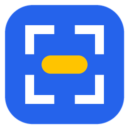
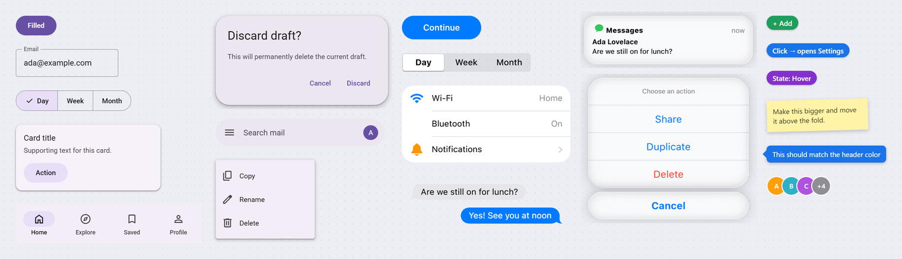

<div align="center">



<h1>UIPaste</h1>

<p><b>Screenshot it. Stick real UI on it. Paste.</b></p>
<p><sub>Snipaste-style capture for Windows, plus drop-in Material 3 / iOS widgets for 10-second mockups.</sub></p>

<a href="README.md"></a> <a href="README.zh-CN.md"></a>

</div>

<br>

## What is this

**A tray app that turns any screenshot into a quick UI mockup.** Press `F1` to grab part of the screen, press `F2` to open a palette of real components, and click one to drop it in as a sticker. Move it, scale it, edit its text, then press `Enter` to copy.

~90 widgets in four groups: **Material 3**, **iOS-style** (iOS 26 look), **Generic** (phone frame, status bar, placeholders), and **Annotate** (Add / Remove / Click → tags, markers, sticky notes for telling an AI or a teammate what to change). The UI widgets aren't drawings. They're real open-source components rendered in WebView2 and captured as transparent PNGs at 3× resolution, so text stays sharp at any size.

<p align="center"></p>

<br>

## 1. Install

> [!TIP]
> **Let your coding agent do it.** Paste this into Claude Code or Codex:
>
> ```
> Install https://github.com/FranklinXuNorth/UIPaste for me: clone it, run `dotnet publish -c Release -o dist`, start dist/UIPaste.exe, and tell me if any hotkey is taken.
> ```

You need Windows 10/11, the [.NET 10 SDK](https://dotnet.microsoft.com/download), and the WebView2 runtime (Windows 11 already has it).

```bash
git clone https://github.com/FranklinXuNorth/UIPaste.git
cd UIPaste
dotnet publish -c Release -o dist
dist/UIPaste.exe
```

It lives in the tray; tick **Start with Windows** in its menu to launch it at login. If another app already holds a hotkey (Snipaste takes `F1`/`F3`), you get a warning; quit that app, or use the tray menu instead.

<br>

## 2. Use it

| Key | What it does |
| --- | --- |
| `F1` | **Capture.** Hover picks a window; drag picks a region. |
| `F2` | **Widgets.** Click to drop into the capture, or copy if no capture is open. `Shift`+click pins it to the screen. |
| `F3` | **Pin** the clipboard as a floating, always-on-top image. |

**In a capture**

| Do | How |
| --- | --- |
| Annotate | Toolbar: rectangle, ellipse, arrow, pen, text, mosaic; `Ctrl+Z` to undo |
| Move a sticker | Drag it |
| Scale proportionally | Mouse wheel, or a corner handle (`Shift` = free resize) |
| Squash or stretch | An edge handle |
| Remove a sticker | Right-click it, or `Delete` |
| Paste in an image | `Ctrl+V` |
| Finish | `Enter` copies · `Ctrl+S` saves *and* copies · `Ctrl+T` pins · `Esc` quits |

**In the palette**, type to search all groups. Right-click a widget to edit its text (labels, values, placeholders, even icon names). Edits are remembered; **Reset** restores the default.

**On a pin**, the wheel zooms, `Ctrl`+wheel changes opacity, and a double-click closes it.

<br>

## Widget sources

The palette loads these at runtime from jsDelivr / Google Fonts. Nothing is bundled.

| Group | Source |
| --- | --- |
| Material 3 | [Material Web](https://github.com/material-components/material-web) (Apache-2.0), Material Symbols, Roboto. App bar, nav bar, segmented and menu are hand-built from M3 tokens, since Material Web doesn't ship them yet. |
| iOS-style | [Framework7 v9](https://github.com/framework7io/framework7) + Framework7 Icons (MIT). These are look-alikes, not Apple assets: Apple doesn't publish an open-source UI kit. |
| Generic, Annotate | UIPaste's own CSS (MIT) |

Add your own components by editing `widgets.html`: anything wrapped in `<div class="w" data-name="…">` shows up in the palette.

<br>

## License

MIT
